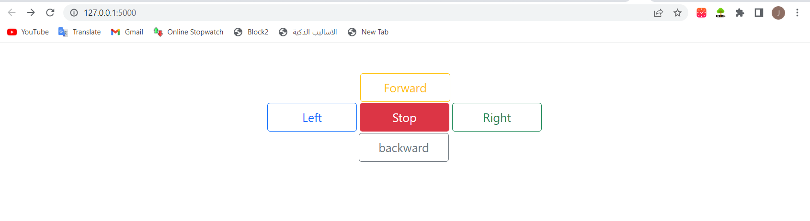
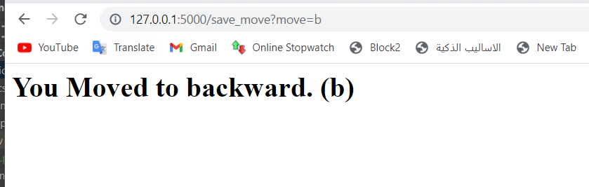
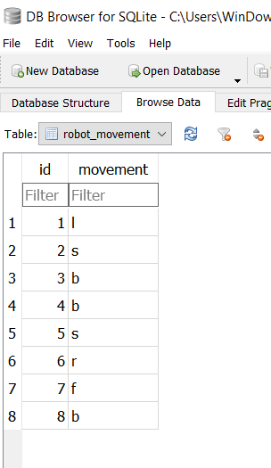

# Robot Control Panel

### This is a website that controls the movement of the robot and saves the movements in a database.

## UI

### When pressed on a button

### The Database

## The Algorithm For Connecting a Web page to The Sensors:
* jj
* ...

# Rana(2022)